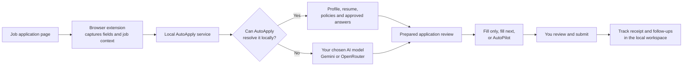

<p align="center">
  
</p>

<h1 align="center">AutoApply</h1>

<p align="center">
  <strong>Prepare faster. Review everything. Submit yourself.</strong>
</p>

<p align="center">
  A local-first job application assistant for Firefox, Chrome, Edge, and Brave.
</p>

<p align="center">
  <a href="https://www.python.org/"></a>
  <a href="https://fastapi.tiangolo.com/"></a>
  <a href="https://www.mozilla.org/firefox/"></a>
  <a href="https://www.google.com/chrome/"></a>
  <a href="https://www.microsoft.com/edge"></a>
  <a href="https://brave.com/"></a>
</p>

<p align="center">
  <a href="https://ai.google.dev/gemini-api"></a>
  <a href="https://openrouter.ai/"></a>
  <a href="LICENSE"></a>
</p>

AutoApply combines a browser extension with a local Python service. It reads application forms, resolves known details from your profile and resume, uses your chosen AI model only when needed, and lets you review the result before anything is submitted.

> AutoApply never clicks the final **Submit** button. You stay in control of every application.

## Screenshots

<!--
Add your screenshots here when ready:


-->

## Why AutoApply

| | |
|---|---|
| **Local-first** | Your profile, resumes, application history, and workspace stay on your computer. |
| **Review-first** | Inspect and edit every prepared field before filling the page. |
| **Model-flexible** | Use Gemini directly or select any model available through OpenRouter. |
| **Cross-browser** | Install on Firefox or Chromium browsers including Chrome, Edge, and Brave. |

## Features

- Reuses profile details, resume data, policies, approved answers, and learned corrections
- Prepares application fields with confidence and review states
- Handles multi-page forms with AutoPilot and stops before submission
- Builds a persistent review queue from multiple job URLs
- Generates tailored answers, cover letters, fit analysis, and resume versions
- Tracks applications, follow-ups, interviews, contacts, and submission receipts
- Supports light, dark, and system themes across the dashboard and extension
- Works with major ATS platforms and falls back to generic form detection

## How it works



Known details stay on the local path. Only unresolved fields are sent to the AI provider you configure, and every route ends with your review before submission.

## AI model support

AutoApply currently provides two provider integrations:

- **Google Gemini** — direct integration using Gemini 2.5 Flash
- **OpenRouter** — set `OPENROUTER_MODEL` to any model available to your OpenRouter account

This gives you access to a broad choice of models without tying AutoApply to one AI vendor. Direct API integrations for providers other than Gemini and OpenRouter are not currently included.

## Quick start

### 1. Set up the local service

```bash
git clone https://github.com/geckguy/AutoApply.git
cd AutoApply
./setup.sh
```

Configure one provider in `backend/.env`:

```env
# Gemini
AI_PROVIDER=gemini
GEMINI_API_KEY=your_key_here
```

or:

```env
# Any model available through OpenRouter
AI_PROVIDER=openrouter
OPENROUTER_API_KEY=your_key_here
OPENROUTER_MODEL=provider/model-name
OPENROUTER_PRIVACY_MODE=strict
```

Start AutoApply:

```bash
source backend/venv/bin/activate
python -m backend.main
```

Open the workspace at [http://127.0.0.1:8000/dashboard](http://127.0.0.1:8000/dashboard).

### 2. Load the extension

#### Firefox

1. Open `about:debugging#/runtime/this-firefox`.
2. Choose **Load Temporary Add-on**.
3. Select `extension/manifest.json`.

#### Chrome, Edge, or Brave

1. Open the browser's extensions page and enable **Developer mode**.
2. Choose **Load unpacked**.
3. Select the `extension-chrome/` folder.

## How to use it

1. Add your profile, resume, and reusable details in the workspace.
2. Visit a job application page.
3. Click the extension or press `Ctrl+Shift+A`.
4. Review the prepared fields.
5. Choose **Fill Only**, **Fill & Next**, or **AutoPilot**.
6. Review the completed application and submit it yourself.

AutoApply includes tailored handling for common platforms such as Workday, Greenhouse, Lever, Ashby, iCIMS, SmartRecruiters, Taleo, and Oracle. Generic form detection supports many other application sites.

## Privacy and safety

- The service and application database run locally.
- There are no AutoApply accounts, analytics, or telemetry.
- Only unresolved fields are sent to your configured AI provider.
- Sensitive authentication, payment, and government-ID fields are excluded.
- AutoPilot advances through safe form steps but never submits an application.

Review your chosen model provider's privacy terms before sending resume or profile information. OpenRouter strict mode requests providers that deny data collection and support zero data retention.

## Development

Run the complete local check suite:

```bash
bash scripts/check.sh
```

```text
backend/             FastAPI service and dashboard
extension/           Firefox extension
extension-chrome/    Chrome, Edge, and Brave extension
tests/               Backend and browser safety tests
```

## License

[MIT](LICENSE)

---

<p align="center">
  <strong>Built with ❤️ and way too many job applications.</strong><br>
  <sub>If AutoApply saved you time, consider giving it a ⭐</sub>
</p>
